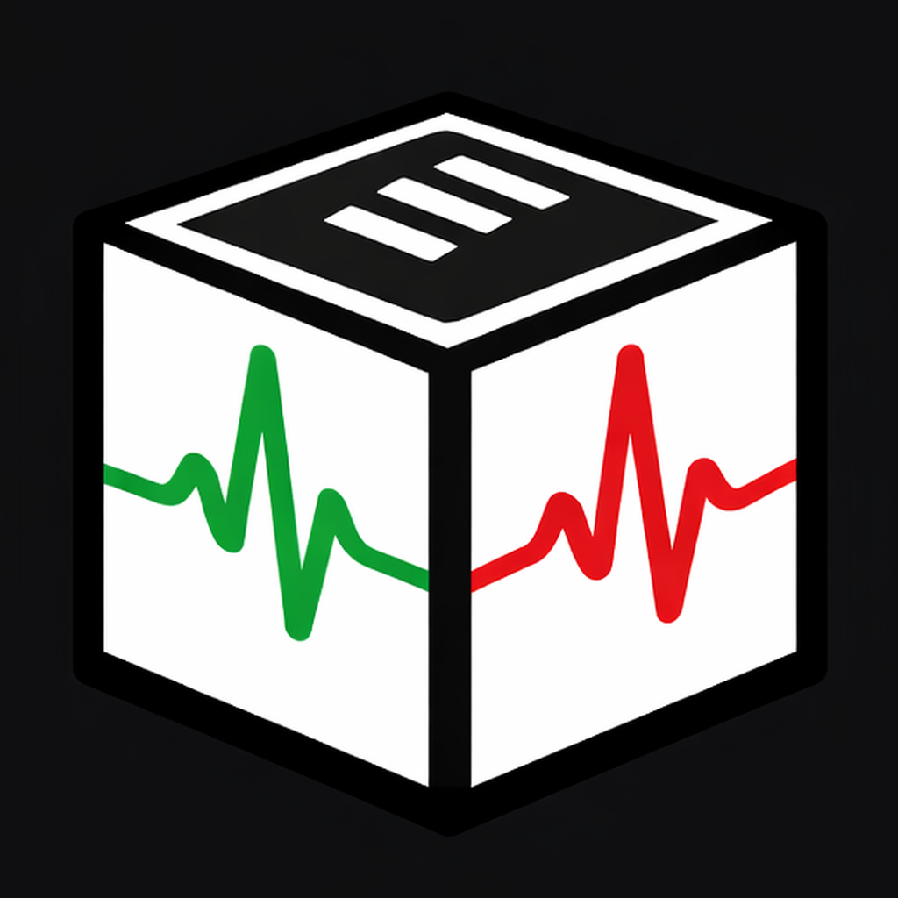
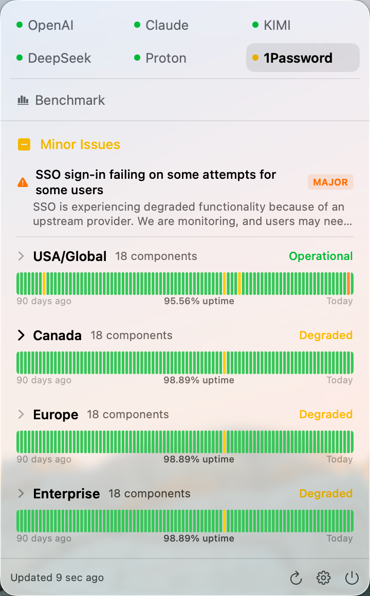
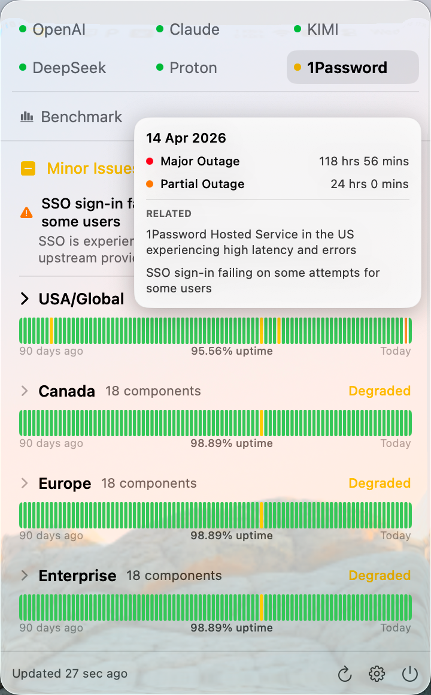
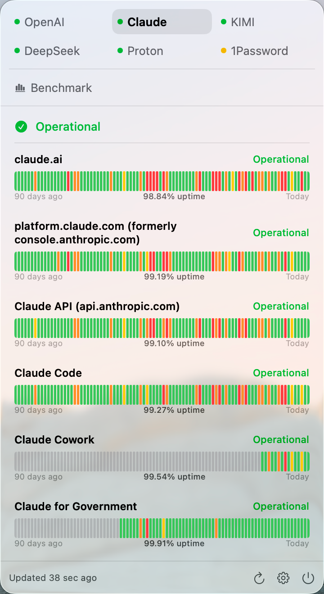
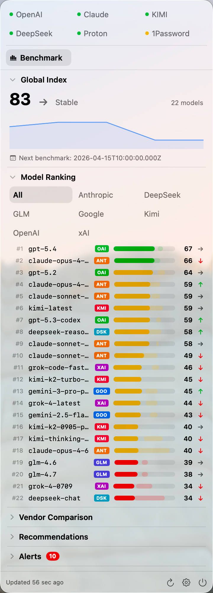
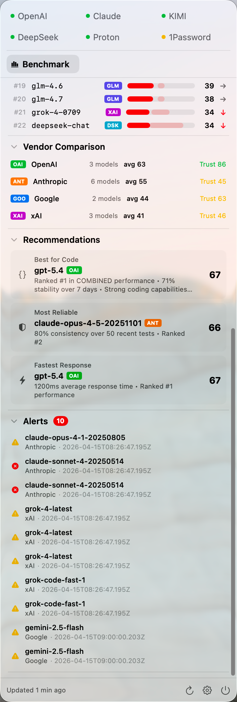
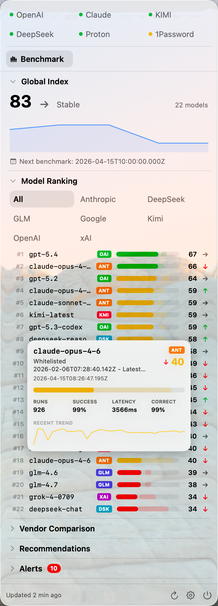

<p align="center">
  
</p>

# MenuStatus

<p align="center">
  <a href="./README.md">English</a> · <a href="./README.zh-CN.md">简体中文</a>
</p>

<p align="center">
  <a href="https://github.com/Snowyyyyyy1/MenuStatus/releases/latest"></a>
  <a href="./LICENSE"></a>
  
</p>

A native macOS menu bar app for two supported kinds of public status pages, plus a built-in AI benchmark snapshot view.

MenuStatus has two primary views:

- **Supported Status Pages**: parse public status pages built on **[Atlassian Statuspage](https://www.atlassian.com/software/statuspage)** and **[incident.io](https://incident.io/status-pages)**
- **[AI Stupid Level](https://www.aistupidlevel.info/)**: check benchmark snapshots including global index, model ranking, vendor comparison, recommendations, alerts, and degradations

<p align="center">
  <a href="https://github.com/Snowyyyyyy1/MenuStatus/releases/latest">Download Latest DMG</a> ·
  <a href="https://github.com/Snowyyyyyy1/MenuStatus/releases">Release Notes</a> ·
  <a href="#build-from-source">Build From Source</a>
</p>

## Screenshots

<p align="center">
  
  
  
</p>

<p align="center">
  
  
  
</p>

## What It Does

### Supported Status Pages

MenuStatus is not a generic parser for arbitrary status sites. It currently supports two status-page platforms only:

- **[Atlassian Statuspage](https://www.atlassian.com/software/statuspage)**
- **[incident.io](https://incident.io/status-pages)**

Built-in providers include **OpenAI** and **Anthropic**. You can also add compatible URLs from services built on those same two formats, such as GitHub, Cloudflare, 1Password, Proton, and similar providers.

From the menu bar you can:

- switch between providers quickly
- inspect grouped components and uptime bars
- view active incidents and recent history
- jump to the official provider status page when you need full context

### AI Stupid Level

MenuStatus also includes an **[AI Stupid Level](https://www.aistupidlevel.info/)** view for quick benchmark snapshots from [`aistupidlevel.info`](https://www.aistupidlevel.info/).

It surfaces:

- global index and trend
- model ranking
- vendor comparison
- recommendations
- alerts
- degradations

This gives the app a second primary workflow alongside service-status tracking: checking whether model quality and reliability appear to be slipping.

## Supported Platforms

| Area | Support |
| --- | --- |
| Status pages | Atlassian Statuspage, incident.io |
| Built-in providers | OpenAI, Anthropic |
| Custom providers | Compatible URLs using those same two formats |
| AI benchmark view | AI Stupid Level |

## Compatibility

### Supported

- Atlassian Statuspage pages
- incident.io pages
- built-in OpenAI and Anthropic providers
- compatible custom URLs using those same two page formats

### Not Supported

- arbitrary custom status websites outside those formats
- providers with fully custom status UIs that do not expose compatible Atlassian Statuspage or incident.io structures

## Download

- Latest builds are published on [GitHub Releases](https://github.com/Snowyyyyyy1/MenuStatus/releases/latest)
- Requires **macOS 14.0+**
- The repository includes a GitHub Actions workflow that builds a Release `.app`, packages it as a `.dmg`, and uploads it to Releases
- Signed release builds can use Sparkle and GitHub Pages appcast updates when signing/notarization is configured

If Apple signing and notarization secrets are not configured yet, the workflow can still publish an unsigned `.dmg` so the release path remains testable end to end.

## Privacy

MenuStatus reads public HTTPS status endpoints and public AI benchmark data. No API keys, no accounts, and no telemetry are required for the core experience.

## Build From Source

### Requirements

- macOS 14.0+
- Xcode 15+ command line tools
- [Tuist](https://tuist.io)

### Run Locally

```bash
./run-menubar.sh
```

To stop:

```bash
./stop-menubar.sh
```

### Development

```bash
# Generate Xcode project
TUIST_SKIP_UPDATE_CHECK=1 tuist generate --no-open

# Build
TUIST_SKIP_UPDATE_CHECK=1 tuist xcodebuild build \
  -scheme MenuStatus -configuration Debug -derivedDataPath .build

# Test
TUIST_SKIP_UPDATE_CHECK=1 tuist xcodebuild test \
  -scheme MenuStatus -configuration Debug -derivedDataPath .build
```

### Publish A DMG Release

Push a version tag and GitHub Actions will build a Release `.app`, package it as a `.dmg`, and upload it to GitHub Releases:

```bash
git tag v0.1.0
git push origin v0.1.0
```

The workflow is defined in `.github/workflows/release.yml` and uses [`package-app.sh`](./package-app.sh).

By default the script uses `hdiutil` so it works reliably in CI. If you want a styled Finder layout locally and already have [`create-dmg`](https://github.com/create-dmg/create-dmg) installed, run `USE_CREATE_DMG=1 ./package-app.sh 0.1.0`.

Optional GitHub repository secrets for signed/notarized builds:

- `APPLE_CERTIFICATE_P12_BASE64`: Base64-encoded Developer ID Application certificate (`.p12`)
- `APPLE_CERTIFICATE_PASSWORD`: Password for the `.p12`
- `APPLE_SIGNING_IDENTITY`: Signing identity, for example `Developer ID Application: Your Name (TEAMID)`
- `APPLE_ID`: Apple ID email used for notarization
- `APPLE_APP_SPECIFIC_PASSWORD`: App-specific password for that Apple ID
- `APPLE_TEAM_ID`: Apple Developer team ID

## Architecture

```text
ProviderConfigStore ──providers──► StatusStore ──@Observable──► SwiftUI Views
                                       │
StatusClient ──fetch & parse───────────┘
                                       │
                                  SettingsStore
                                  (UserDefaults)

AIStupidLevelClient ──fetch──────────► AIStupidLevelStore ──@Observable──► AIStupidLevelPageView
```

| Layer | Responsibility |
|-------|----------------|
| **Status Models** (`StatusModels.swift`) | Provider configs, incidents, component uptime, presentation types |
| **Provider Config** (`ProviderConfigStore.swift`) | Runtime provider list, persistence, auto-detection |
| **Status Client** (`StatusClient.swift`) | Network requests and HTML parsing for Atlassian Statuspage and incident.io |
| **Status Store** (`StatusStore.swift`) | Observable state, polling, history derivation, grouped sections |
| **AI Stupid Level Client** (`AIStupidLevelClient.swift`) | Benchmark, alerts, recommendations, degradations, and model-detail fetches |
| **AI Stupid Level Store** (`AIStupidLevelStore.swift`) | Observable benchmark state, caching, polling, and hover prefetching |
| **Views** | MenuBarExtra, provider tabs, uptime rows, benchmark panels, settings |

Generated `.xcodeproj` / `.xcworkspace` and build outputs (`.build/`, `Derived/`) are gitignored.

## License

Licensed under [AGPL-3.0](./LICENSE).
