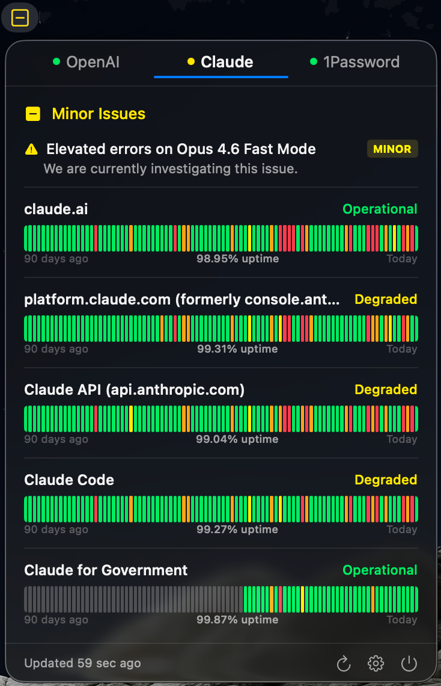

# MenuStatus

Monitor the public status of any service — right from your macOS menu bar.

Supports [Atlassian Statuspage](https://www.atlassian.com/software/statuspage) and [incident.io](https://incident.io) powered status pages. Ships with **OpenAI** and **Anthropic** built in. Add any compatible service (GitHub, Cloudflare, 1Password, Twilio, ...) by pasting its status page URL.

<p align="center">
  
</p>

## Install

### Requirements

- macOS 14.0+
- Xcode 15+ command line tools
- [Tuist](https://tuist.io)

### Build & Run

```bash
./run-menubar.sh
```

To stop:

```bash
./stop-menubar.sh
```

## Features

- **Menu bar only** — no Dock icon, no window clutter (`LSUIElement`)
- **Multi-provider tabs** — switch between services with a single click
- **90-day uptime bars** — per-component timeline with hover tooltips
- **Active incidents** — see ongoing issues and severity at a glance
- **Adaptive icon** — system template when all clear, colored when degraded
- **Auto-detection** — paste a URL, the app figures out the platform and service name
- **Configurable polling** — 30 seconds to 10 minutes (default 60s)
- **Launch at login** — optional, toggle in Settings
- **Import / Export** — share provider configs as JSON

## Supported Platforms

| Platform | Examples | How it works |
|----------|----------|--------------|
| Atlassian Statuspage | Anthropic, GitHub, Cloudflare, 1Password, Twilio | Parses `/api/v2/summary.json` + SVG fill colors for history |
| incident.io | OpenAI | Parses `/api/v2/summary.json` + Next.js JSON blocks for history |

Services with fully custom status pages (Google Cloud, AWS) are not supported.

## Adding a Provider

**In the app:** Settings (gear icon) → paste a status page URL → done.

**Via JSON import:**

```json
{
  "providers": [
    { "name": "GitHub", "url": "https://www.githubstatus.com" },
    { "name": "Cloudflare", "url": "https://www.cloudflarestatus.com" }
  ]
}
```

Custom providers are stored in `~/Library/Application Support/MenuStatus/providers.json`.

## Privacy

MenuStatus only reads public HTTPS status endpoints. No API keys, no accounts, no data collection.

## Architecture

```
ProviderConfigStore ──providers──► StatusStore ──@Observable──► SwiftUI Views
                                       │
StatusClient ──fetch & parse───────────┘
                                       │
                                  SettingsStore
                                  (UserDefaults)
```

| Layer | Responsibility |
|-------|----------------|
| **Models** (`StatusModels.swift`) | Provider configs, API types, timeline builders |
| **Provider Config** (`ProviderConfigStore.swift`) | Runtime provider list, persistence, auto-detection |
| **Client** (`StatusClient.swift`) | Network requests, HTML parsing per platform |
| **Store** (`StatusStore.swift`) | Observable state, polling, presentation derivation |
| **Settings** (`SettingsStore.swift`) | UserDefaults preferences |
| **Views** | MenuBarExtra, tabs, component rows, uptime bars |

## Development

```bash
# Generate Xcode project
TUIST_SKIP_UPDATE_CHECK=1 tuist generate --no-open

# Build
TUIST_SKIP_UPDATE_CHECK=1 tuist xcodebuild build \
  -scheme MenuStatus -configuration Debug -derivedDataPath .build

# Test
TUIST_SKIP_UPDATE_CHECK=1 tuist xcodebuild test \
  -scheme MenuStatus -configuration Debug -derivedDataPath .build
```

Generated `.xcodeproj` / `.xcworkspace` and build outputs (`.build/`, `Derived/`) are gitignored.

## License

MIT
